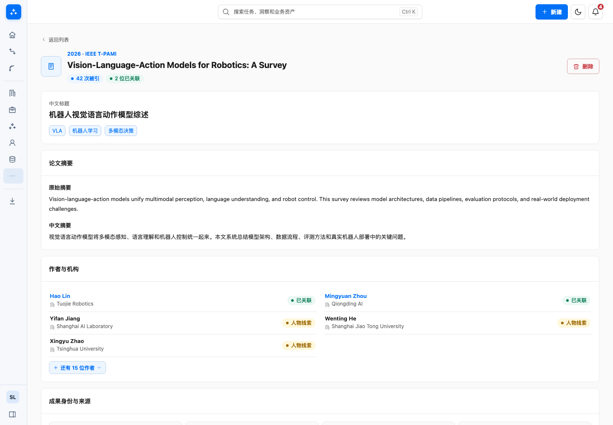
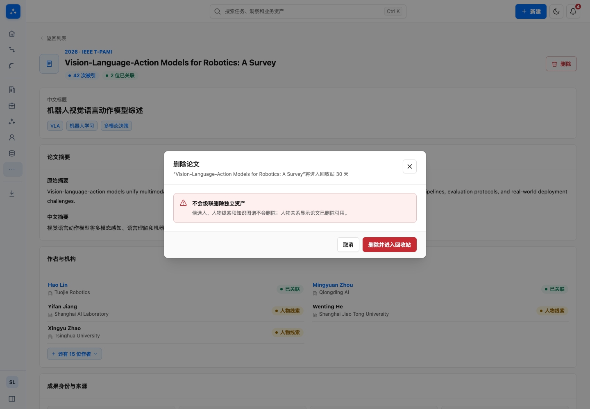
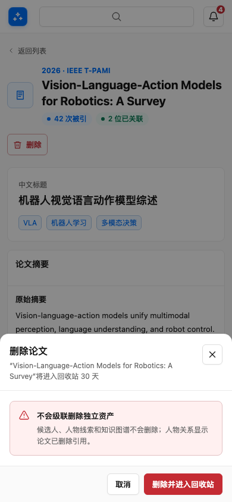

# 全原型与详细设计交叉检查

## 范围

以 `d3b0997` 为起点，对照 14 篇详细设计与实际源代码，检查 45 个主页面及相关工作流。不修改概要设计、产品原则、业务对象关系和授权规则，不重做视觉体系。

## 本轮修正

| 问题 | 修正与验证 |
| --- | --- |
| 周期目标残留旧频率，改期后标题或下次运行沿用旧值 | 目标与周期分离，原始请求保留，列表读取确认后的配置 |
| 周期配置暂停、删除后刷新恢复 | 浏览器会话保存配置变更，全部删除使用已有空态 |
| 手动运行覆盖历史，等待状态可被任意回复解除 | 活跃运行复用、唯一运行 ID、实际选择与授权校验，否定不会隐式确认 |
| 周期运行状态及对话顺序不一致 | 列表、详情、返回、刷新共用状态，筛选后继续仍停留在原记录，消息按实际先后保留 |
| 无当前安排仍声称已完成跟进事项 | 写入前整体校验，失败不保存半条记录 |
| 分页数量提示与实际数量不同 | 资产列表 6 条、论文专利 4 条、导入 2 条显式传入公共分页组件 |
| 手机图谱画布被详情压缩 | 保留原单列结构，画布固定 520px，桌面布局不变 |
| 手机回收站选择框遮挡清理状态 | 选择框固定在条目顶部，边界框检查无重叠 |
| 论文编辑及删除超出本轮范围 | 按用户确认移除论文编辑，单项和批量删除复用公共确认 Modal，不声称真实回收已完成 |

详细设计同步修正执行计划位置、岗位储备与正式推进边界、合并告知顺序、匹配入口、候选人/岗位 Tab 清单、先补齐 JD 再建岗、空图谱、运行记录保留、用量展示及运营脱敏与恢复口径。

## 公共组件

- `PeriodicTasksPage`、`RunDetail` 复用 `HunterReply`、`Composer`、`DecisionRequest`、`Modal`，状态辅助放在 `periodic-draft.js`。
- 学术资产删除复用 `DeleteAssetModal`；没有新增编辑器或资产状态仓库。
- 分页继续使用 `Pagination`；图谱、回收站只修正既有响应式 CSS，无新增 token。

## 验证

- 45 个主页面在桌面和手机完成 90 项加载、宽度和错误冒烟；变更后 20 项受影响页面补跑通过。
- 109 项不同的相关 E2E 分批通过，覆盖本轮修正、任务与洞察、资产、图谱、认证、设置和运营。修正旧标题断言后定向复测，不反复执行整个原型的全量套件。
- 30 项单元测试、生产构建通过；构建仍有原有的部分分块大于 500 kB 提示。
- 已检查桌面/手机修改前后截图，截图和复现结果保存在 `artifacts/full-review-20260908/`。

## 已确认边界

用户明确本轮学术资产删除仅要求确认 Modal。2026-09-08 后续人工验收进一步取消论文/专利编辑和列表批量加入图谱，仅保留删除；这些不是待补做功能。论文/专利真实删除恢复、既有未生效的学术列表状态链接不属于本轮完整数据闭环；不能把成功提示、正常截图或路由冒烟当作上述能力已验收。公司联系人导入、公司回收联动的原有待确认事项继续保留。后续四项修正见 [人工验收反馈](acceptance-feedback-20260908.md)。

原型使用浏览器示例数据与会话状态，不代表真实模型、采集、邮件、后台调度、计费或租户隔离已经实现。Hunter 正式产品代码未修改。

## 配图

