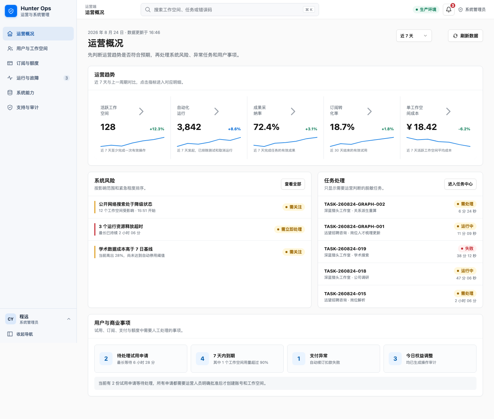
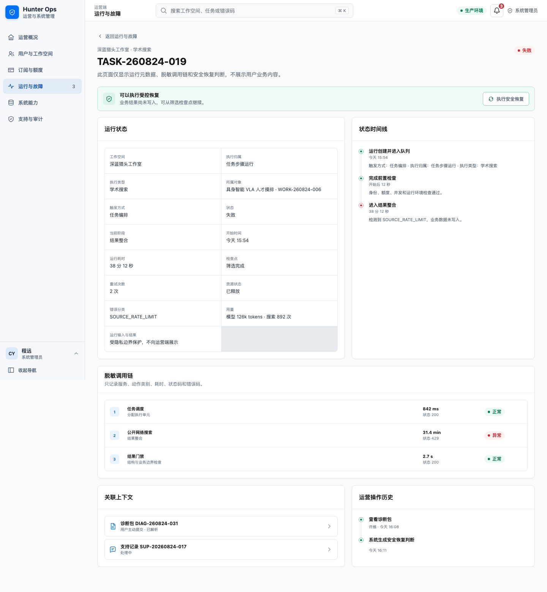
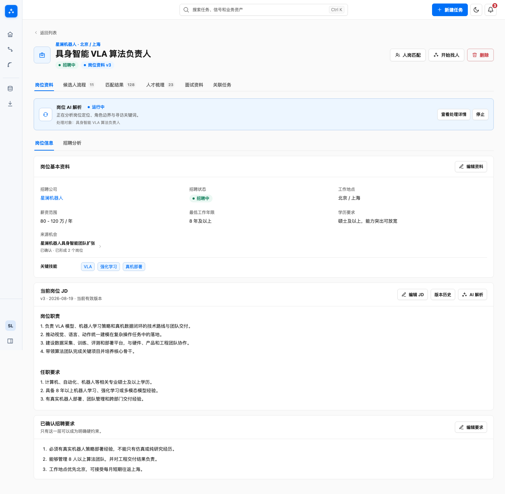

# Hunter 阶段一原型与详细设计全量 Review

> 日期：2026-09-02  
> 范围：当前高保真原型、在线 `00—13` 产品详细设计、原型与文档之间的入口及业务口径  
> 结论：当前原型与 `00—13` 产品详细设计之间没有需要重构信息架构的阻塞问题。本轮交互和文档入口问题均已在原型、测试和详细设计内收敛；《Hunter 阶段一产品概要设计》仍保留“业务主线 / 支线任务 / 配套寻访 App”等旧口径，需要另行形成经产品负责人确认的修订版本，不能在本轮审计中静默改写。

## 一、Review 目标

本轮不只检查页面是否可打开，还重点检查以下问题：

1. 用户是否能理解当前页面的目标、状态和下一步。
2. 页面是否存在重复说明、无谓信息或过多同时竞争注意力的内容。
3. 正常、等待、失败、空数据、权限受限和恢复路径是否有明确入口。
4. 任务、运行、资产 AI、系统运行、信号和正式资产的口径是否一致。
5. 原型数据、页面状态和在线详细设计是否能够相互对照。
6. 桌面、平板和手机是否存在溢出、遮挡、过渡叠透或无法操作的控件。
7. 控件是否具备可读名称，是否泄漏浏览器原生控件样式。

## 二、检查方法

1. 对 `136` 个在线详细设计原型入口逐一打开，检查实际路由、页面标题和控制台错误。
2. 运行全部 Playwright 测试，覆盖用户端、运营端、Landing Page、认证、设置、业务资产、任务、信号、知识图谱和关键异常状态。
3. 对代表性桌面和移动页面重新截图，人工检查信息层级、引导、遮挡和响应式结果。
4. 执行 DOM 级检查，查找无名称按钮、无标签输入框、原生下拉框、重复 `id` 和非预期裁切。
5. 重新读取在线 `00—13` 详细设计，核对章节职责、对象关系、关键状态、原型链接和跨文档用词。
6. 保持《Hunter 阶段一产品概要设计》不变；只有详细设计和原型均无法承载既定产品决策时，才允许提出概要设计变更。

## 三、审计健康度

| 维度       | 得分        | 结论                                                                                                                     |
| ---------- | ----------- | ------------------------------------------------------------------------------------------------------------------------ |
| 可访问性   | 3 / 4       | 主要控件已有语义和键盘基础；本轮补齐列表选择、图标编辑、任务输入和关系编辑字段的可读名称，尚未进行完整读屏软件人工验收。 |
| 性能       | 2 / 4       | 页面运行稳定，但生产构建的主 JavaScript 与 CSS 体积超过正式产品应接受的范围；正式开发需要按业务域拆包。                  |
| 响应式     | 3 / 4       | 代表性桌面、平板和手机页面没有横向溢出，移动详情层级清楚；高密度图谱和表格仍需在正式实现中持续做真机手势验证。           |
| 主题       | 4 / 4       | 用户端和运营端的浅色、深色语义一致，删除、警告、标签和导航在两种主题下有明确层级。                                       |
| 实现完整性 | 4 / 4       | 原型使用共享组件、统一路由和数据配置，任务、运行、资产 AI、系统运行的边界清楚，没有发现页面级临时视觉体系。              |
| **合计**   | **16 / 20** | **良好；可以作为技术方案和开发评估输入，但性能预算与读屏验收需要进入正式研发门禁。**                                     |

本轮共确认并修复 `0` 个 P0、`5` 个 P1 和 `3` 个 P2 问题。审计截图只能证明视觉、布局和部分交互状态，不能单独证明完整 WCAG 合规、真实数据性能或后端恢复能力。

## 四、发现与修复

### 4.1 原型交互与信息表达

| 级别 | 问题                                                                   | 影响                                   | 修复                                                               |
| ---- | ---------------------------------------------------------------------- | -------------------------------------- | ------------------------------------------------------------------ |
| P1   | 移动端打开信号详情时，入场动画会降低整个详情层透明度，短暂露出后方列表 | 用户在最需要阅读详情时看到两层内容叠加 | 入场动画只保留轻微位移，详情层始终保持不透明；增加移动端回归断言   |
| P1   | 关系审核确认后，右侧显示“已确认写入”，左侧仍显示“待确认”               | 同一决定在一个页面出现两个状态         | 变化列表和详情面板共用同一决定状态；确认、跳过和重新选择均同步更新 |
| P1   | 任务列表说明使用“资产 AI 处理和任务内部运行”等内部边界解释             | 用户需要先理解系统实现才能知道页面用途 | 改为“集中查看你发起的任务，并从最近进展继续推进”                   |
| P2   | 自动化授权页在页头、提示条和分区说明中重复解释生效范围                 | 信息重复，页面视觉重心被提示条抢占     | 删除重复提示条，保留页头和分区内与操作直接相关的说明               |
| P2   | 工作台日期固定为旧日期                                                 | 演示时容易被误认为数据没有更新         | 日期按访问当天生成，业务 Mock 内容保持稳定                         |

### 4.2 可访问性与操作明确性

| 级别   | 问题                                           | 修复                                                      |
| ------ | ---------------------------------------------- | --------------------------------------------------------- |
| P1     | 资产列表行选择框没有可读名称                   | 全选显示“选择当前页全部数据”，行选择显示“选择 + 资产名称” |
| P1     | 候选人教育和项目经历的图标编辑按钮没有可读名称 | 补充包含对象名称的 `aria-label`                           |
| P1     | 任务对话输入框和公司关系角色字段只有视觉上下文 | 补充独立 `aria-label`，避免读屏用户只能听到“文本框”       |
| 已通过 | 可见输入框缺少标签                             | 未发现                                                    |
| 已通过 | 可见原生 `select`                              | 未发现                                                    |
| 已通过 | 重复 DOM `id`                                  | 未发现                                                    |

收起导航、表格截断和 `+N` 标签产生的裁切属于已设计的展示策略，并由产品 Tooltip 或展开交互承载，不作为缺陷修改。

### 4.3 数据与对象关系

1. 运营端三条系统运行此前错误绑定到用户任务或资产名称。本轮改为无用户任务归属，并继续保留触发来源和影响范围。
2. 任务、任务步骤、资产 AI 和系统运行的分类与在线 `01`、`03`、`13` 详细设计保持一致。
3. 未发现需要修改候选人、岗位、公司、联系人、招聘机会、知识图谱、论文或专利数据结构的新增矛盾。

### 4.4 在线详细设计

1. `01 对象关系与写入规则` 的岗位资产 AI 入口和运行中入口使用了已删除路由，已改为岗位资料页中的资产 AI 状态参数。
2. `03 运行、等待、恢复与清理` 的版本摘要仍使用“统一工作执行、相关任务执行”等旧口径，已改为四类运行的当前名称；资产 AI 运行和失败入口同步修正。
3. `13 运营端` 的不可安全恢复入口引用不存在的运行编号，已改为现有不可安全恢复样例。
4. 其余 `133` 个业务入口均能进入对应页面或状态；两个加载态按设计只显示骨架，不要求出现页面 `H1`。
5. 在线文档中的对象关系、写入边界、异常恢复和关键状态未发现需要重写的矛盾。

## 五、交叉 Review 结论

1. 用户只创建和管理“任务”；资产详情中的确定性 AI 操作不进入任务列表。
2. 运行是系统执行记录，不是用户需要管理的第二套任务。
3. 系统运行可以没有用户任务归属，但必须保留触发来源、影响范围和恢复判断。
4. 正式资产、关系和派生文件的写入边界与各资产详细设计一致。
5. 原型中的正常、加载、空、失败、权限受限、等待和恢复状态均有可访问入口。
6. 原型和详细设计已经采用统一的用户可见“任务”口径，并取消与本机寻访 App 通信协作；概要设计仍保留旧口径。本轮不直接修改概要设计，但该差异必须在后续概要设计修订中由产品负责人确认并消除。

### 5.1 代表性视觉证据

## 六、剩余风险

1. 生产构建仍提示主 JavaScript 和 CSS 体积较大。当前是覆盖大量页面和状态的高保真原型，不影响本轮产品验收；正式开发应按业务域拆包并设置性能预算。
2. 在线详细设计中的截图是研发理解交互的辅助材料，最终实现仍应以原型实时状态、详细设计规则和验收测试共同判断，不能只照静态截图开发。
3. 概要设计与当前详细设计之间存在版本口径差异。研发可以开始基础架构、对象模型和运行框架评估，但在估算统一任务入口、来源边界和本机协作相关范围前，应先以当前详细设计为准，并等待概要设计正式修订。

## 七、完成门禁

本轮在以下条件全部满足后结束：

1. 格式检查和生产构建通过。
2. Playwright 全量测试通过。
3. 代表性桌面与移动截图无新增遮挡或横向溢出。
4. 在线详细设计入口重新抽查通过。
5. 运营端文档截图保持完整。
6. GitHub Pages 部署成功，线上路由可访问。

### 7.1 实际验证结果

| 检查项                  | 结果                                                                                       |
| ----------------------- | ------------------------------------------------------------------------------------------ |
| `npm run format:check`  | 通过                                                                                       |
| `npm run build`         | 通过；保留主包体积告警                                                                     |
| Playwright 全量回归     | `218` 项全部通过                                                                           |
| 路由专项                | `2` 项全部通过                                                                             |
| 详细设计原型入口        | `136` 个入口全部可访问                                                                     |
| DOM 可访问性扫描        | `0` 个无名称按钮、`0` 个无标签可见输入框、`0` 个原生下拉框、`0` 个重复 `id`                |
| Hunter 既有重点能力测试 | 岗位 Agent、候选人补全、OpenAlex 身份、人岗匹配角色门禁、人才地图跨格式共 `153` 项全部通过 |
