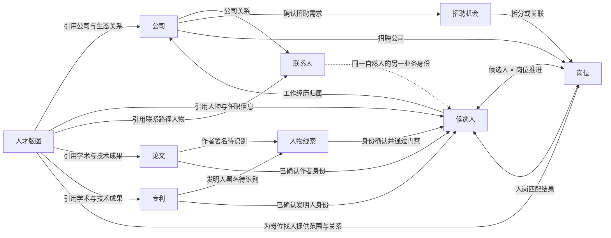

# 原型阶段四：业务资产模型与关系设计基线

> 2026-08-30 口径更新：本文中的“工作”“业务主线”“支线任务”统一按用户任务理解；资产内 AI 处理与运行不进入任务列表，关系字段统一显示为“关联任务”。

> 状态：模型交叉验证通过，已用于阶段四完整原型；等待人类审批后冻结。
>
> 日期：2026-08-21。
>
> 用途：定义 Hunter SaaS 阶段一业务资产的产品数据结构、关系、生命周期、写入与删除边界，作为阶段四高保真原型和后续产品详细设计的共同依据。本文不指定数据库、API、搜索引擎或图数据库实现。

## 一、设计目标

阶段四不是把当前 Hunter 的八个页面换一套视觉，而是先建立一套能够支撑长期自动化业务的资产模型。完成后需要保证：

1. 用户能够知道一条信息属于哪个正式资产、来自哪里、当前是否可信、何时更新。
2. 业务主线和支线任务产生的结果可以写入正式资产，但不能把运行日志、草稿或推断直接冒充业务事实。
3. 公司、联系人、招聘机会、岗位、候选人、人才版图、论文和专利之间可以形成稳定、可解释、可修正的关系。
4. 同一份业务事实只维护一份；列表、详情、业务主线和关系图读取同一来源，不复制出互相漂移的数据。
5. 用户可以手工维护资产，也可以让 Agent 提出新增或更新建议；两种入口经过相同的身份、重复、结构、权限和写入门禁。
6. 删除、恢复、合并、解除关联和资料更新都能说明影响范围，不通过级联删除破坏其他独立资产。

## 二、阶段一正式资产边界

阶段一共有八类正式业务资产：

| 资产     | 保存的长期事实                                                     | 不应混入的内容                                          |
| -------- | ------------------------------------------------------------------ | ------------------------------------------------------- |
| 公司     | 公司资料、招聘特征、任职人才、招聘业务和人才版图关联               | 一次公司调研日志、未经确认的公司猜测、单一客户状态      |
| 联系人   | 可持续识别和联系的自然人、类别、联系方式、公司关系和沟通记录       | 只有“某公司 HR”这类无法识别自然人的线索、完整候选人简历 |
| 招聘机会 | 已确认存在但尚未完全转化为正式岗位的招聘需求                       | 只有融资或扩张迹象的信号、完整岗位招聘流程              |
| 岗位     | 已达到招聘执行门槛的岗位资料、JD 版本、招聘要求和分析建议          | 某位候选人的推进状态、一次 Agent 输出草稿               |
| 候选人   | 同一自然人的统一人才档案、经历、联系方式、简历、偏好和来源         | 某个岗位下的匹配结论和招聘推进状态                      |
| 人才版图 | 围绕明确摸排目标形成的公司生态、组织、方向、人物、关系、证据和差距 | 一次 Agent 任务、静态报告、公司或候选人档案副本         |
| 论文     | 客观学术成果、作者署名、机构、标识、摘要、来源和人物关联           | 招聘状态、作者的完整候选人档案                          |
| 专利     | 客观技术成果、发明人、申请人、标识、摘要、来源和人物关联           | 招聘状态、发明人的完整候选人档案                        |

以下对象不是正式业务资产：

1. 人物线索、联系人线索和公司线索。
2. 机会与信号。
3. 业务主线、内部任务和独立支线任务。
4. Agent 草稿、字段建议、待确认关系和审核批次。
5. 文件、来源、证据、沟通记录和变更记录。
6. 人岗匹配结果和候选人 × 岗位推进关系。

这些对象仍需要保存和管理，但其生命周期、写入门槛和用户含义与正式资产不同。

## 三、统一六层模型

业务资产采用六层产品模型。页面可以按用户任务组合展示，不要求用户理解内部层级名称。

### 3.1 第一层：正式资产本体

保存对象当前有效的核心资料和稳定身份，例如候选人姓名、岗位名称、公司名称、论文标题。正式资产本体只保存该对象自身的事实，不保存其他对象上下文中的状态。

### 3.2 第二层：结构化子记录

保存一个资产内部可以独立增删、排序、更新和追溯的内容，例如：

1. 候选人的工作经历、教育经历、项目经历、联系方式、公开资料链接和简历版本。
2. 岗位的 JD 版本、已确认招聘要求、岗位分析和推进阶段配置。
3. 联系人的公司关系和联系方式。
4. 人才版图中的组织单元、方向、角色和目标清单。
5. 论文作者署名与专利发明人署名。

结构化子记录不应被压成一个不可局部维护的 JSON 文本，也不应为了数据库方便拆成用户无法理解的碎片。

### 3.3 第三层：稳定业务关系

保存两个或多个对象之间经过确认的业务事实，例如：

1. 候选人的某段工作经历关联某家公司。
2. 岗位关联招聘公司。
3. 联系人与公司存在当前或历史关系。
4. 联系人与候选人属于同一自然人。
5. 论文作者或专利发明人关联人物线索或候选人。
6. 人才版图引用公司、候选人、联系人、论文或专利。

每条关系至少需要表达关系类型、方向、作用范围、来源或确认方式、当前状态和时间。关系图中的坐标和连线样式不是关系事实。

### 3.4 第四层：业务过程记录

保存“某个业务上下文里发生了什么”，不能回写成资产的全局状态。阶段一重点包括：

1. 候选人 × 岗位推进关系及阶段转换历史。
2. 人岗匹配结果及历史版本。
3. 人工跟进备注与真实沟通记录。
4. 招聘机会向岗位的转换关系。
5. 人才版图变更批次、目标完成项和已接受缺口。
6. 资产在业务主线和支线任务中的引用与使用结果。

### 3.5 第五层：来源、证据和关联资料

来源说明信息从哪里得到，证据说明该来源支持什么结论，文件保存原始资料。三者可以关联资产、子记录、关系、过程记录或 Agent 建议，但不复制业务事实。

阶段一至少需要支持：

1. 网页、用户输入、用户上传文件、公开数据库、论文、专利和沟通记录等来源。
2. 获取时间、观察时间、支持结论、证据片段、可信状态和原文入口。
3. PDF、DOCX、图片、表格、简历、推荐材料和其他普通附件。
4. 一份文件被多个业务对象引用，但文件实体只保存一份。

### 3.6 第六层：提案、审核和变更历史

Agent、导入、文件解析和系统识别先形成提案，不直接修改正式资产。提案经过 Hunter 门禁后进入用户确认或已授权的自动确认；正式写入后形成变更记录。

这层至少区分：

1. 新建资产草稿。
2. 现有资产字段变更。
3. 身份重复与合并建议。
4. 关系新增、修改、失效或解除建议。
5. 结构错误、证据不足、权限不足和业务冲突。
6. 已确认、已拒绝、已过期、已被其他操作处理和失败。

## 四、统一资产外壳

八类正式资产都需要具备以下共同信息。字段名称是产品含义，不是数据库列名约束。

| 字段组   | 内容                                   | 用户可见方式                                  |
| -------- | -------------------------------------- | --------------------------------------------- |
| 稳定身份 | 资产 ID、所属工作空间、资产类型        | ID 默认不展示；复制链接、排错和导入导出时可用 |
| 展示身份 | 主要名称或标题、必要的副标题           | 列表与详情首屏展示                            |
| 创建信息 | 创建时间、创建方式、创建人或自动化来源 | 详情来源区域或变更记录                        |
| 更新信息 | 最近更新时间、最近更新方式、资料新鲜度 | 列表可配置列；详情摘要显示                    |
| 数据版本 | 当前资料版本、匹配或分析所依赖的版本   | 发生过期或冲突时显示，不要求用户日常维护      |
| 删除信息 | 正常或已删除、删除时间、回收站到期时间 | 正常页面不展示已删除资产；回收站中显示        |
| 关联摘要 | 关键关联对象数量和入口                 | 详情 Tab 或列表可配置列，不复制关联详情       |

正式资产不统一增加“进行中、已完成”等泛化状态。只有岗位、招聘机会等确实存在业务生命周期的资产才拥有自己的状态；人才版图、候选人、公司、联系人、论文和专利保持普通资产状态，待确认、过期和冲突作为提醒而不是资产状态。

## 五、关系总图

图中只表达主要正式关系。人物线索位于论文、专利、人才版图和正式候选人之间的身份确认阶段；业务主线、支线任务、信号、来源、文件和变更记录可以引用所有正式资产，但不是新的资产副本。

## 六、正式资产之外的必要支撑对象

### 6.1 人物线索

人物线索承接“已经发现一个可能有业务价值的人，但资料不足或身份仍不确定”的情况。它不是低配候选人，也不进入正式候选人列表。

人物线索至少保存：

1. 原始姓名、来源中的身份表述和必要的显示摘要。
2. 论文作者、专利发明人、人才版图人物、公开网页或用户输入等来源。
3. 能够取得的机构、职位、外部身份和其他消歧信息。
4. 与现有候选人的可能身份关系、判断依据和当前处理状态。
5. 产生它的业务主线、任务、人才版图或成果引用。

人物线索只有在满足正式候选人创建门槛，并经过身份识别、重复检查和写入门禁后，才能由用户确认或已授权自动转换为候选人。单纯导入一篇论文或专利不会为所有作者或发明人批量创建人物线索。

### 6.2 组织单元

组织单元用于复用已经确认的事业部、部门、实验室和团队身份。它保存公司归属、标准名称、已确认名称变体和必要的识别信息，不保存脱离业务上下文的全局组织树。

上下级结构、方向、角色、人物分布、适用时间和可信状态仍属于具体人才版图。同一组织单元可以被不同版图引用，并在不同时间和视角下形成不同结构。

### 6.3 真实沟通与人工备注

一条真实邮件或人工补录的已发生沟通只保存一次，再按明确关系显示在联系人、候选人、公司、招聘机会、岗位和业务主线中。阶段一结构化联系方式只支持手机和邮箱，系统直接发送和读取的云端沟通渠道只设计邮件；电话、线下和其他沟通结果由用户使用人工备注或人工补录沟通回流。

真实沟通至少保存发送方、接收方、方向、渠道、发送身份、原始内容、附件、发生时间、发送状态、外部消息身份、回复关系、同步时间和业务关联。无法判断业务上下文时只将关联置为待确认，不能复制消息或猜测归属。

发送前草稿属于过程成果；发送成功、收到回复或用户明确补录后才形成真实沟通。等待回复时任务进入“等待外部”，不持续运行 Agent 或消耗 Agent 用量。

## 七、关系建模原则

### 7.1 原始文本与稳定关联并存

外部资料中的公司、组织、人物和成果名称必须保留原文。系统确认对应正式资产后再增加稳定关联，不能用正式名称覆盖原始表述。

例如候选人经历中的“阿里巴巴-达摩院”需要同时保存：

1. 原始公司文本“阿里巴巴-达摩院”。
2. 可选的正式公司关联“阿里巴巴”。
3. 原始组织单元文本“达摩院”。
4. 可选的正式组织单元关联。

字符串完全匹配、包含匹配和 Agent 判断只负责召回候选关系；用户确认或符合自动授权且通过强制门禁后，关系才成为正式事实。

### 7.2 全局事实与场景事实分开

同一个对象在不同业务上下文中的判断不能污染全局档案。例如：

1. 候选人的技能和经历是全局档案；某个岗位下的匹配分、风险和推荐动作属于匹配结果。
2. 公司简介是全局档案；公司在某份人才版图中属于上游、竞品或目标公司是版图内关系。
3. 联系人的手机号是联系人资料；其在某次客户开发中是否为首选联系人属于业务主线上下文。
4. 岗位的招聘状态是岗位状态；某个候选人在岗位中的面试阶段属于候选人 × 岗位推进。

### 7.3 关系可多重、可定向、可限定范围

同一对对象可以存在多种关系。例如两家公司可以同时存在投资、竞争和人才流动关系；两个人可以同时是前同事和共同作者。每种关系分别保存，不能互相覆盖。

关系需要按实际业务表达：

1. 是否有方向。
2. 适用公司、版图、技术方向或业务范围。
3. 生效和失效时间。
4. 已确认、待确认、推断或已失效。
5. 来源、证据和用户确认记录。

### 7.4 身份关联不等于业务关系

联系人和候选人属于同一自然人，是身份关系；联系人认识某位候选人，是人物关系；联系人为某个岗位提供信息，是业务上下文。三者不能使用同一字段表达。

### 7.5 关系必须可解释和可修正

用户从任何自动形成的关系都能看到原始文本、关联对象、依据、来源和确认状态。错误关系允许解除，解除不删除两端资产；系统保留纠正记录，避免重复建议同一错误关系。

### 7.6 每类关系只有一个事实所有者

同一关系可以在多个页面显示，但只能由一个业务对象或关系记录维护。阶段一采用以下所有权：

| 业务事实                           | 唯一事实所有者           | 其他页面如何使用                                 |
| ---------------------------------- | ------------------------ | ------------------------------------------------ |
| 候选人曾在某公司任职               | 候选人的工作经历         | 公司“任职人才”反向汇总，不能在公司页另建任职事实 |
| 岗位由某公司招聘                   | 岗位的正式公司关系       | 公司“招聘业务”反向汇总                           |
| 联系人与某公司存在关系             | 联系人—公司关系记录      | 公司联系人 Tab 和联系人详情读取同一关系          |
| 某招聘机会形成哪些岗位             | 招聘机会—岗位转换关系    | 招聘机会和岗位详情互相显示来源入口               |
| 候选人在某岗位推进到哪里           | 候选人 × 岗位推进        | 候选人、岗位、公司推进和业务主线读取同一记录     |
| 候选人与岗位是否匹配               | 人岗匹配结果版本         | 候选人和岗位详情读取同一结果，不能各自保存分数   |
| 某人是论文作者或专利发明人         | 成果署名及其人物身份关系 | 候选人和人才版图反向展示                         |
| 公司、人物和关系在某次摸排中的作用 | 人才版图上下文关系       | 正式资产详情只显示该版图中的位置和入口           |
| 一次真实沟通发生了什么             | 真实沟通记录             | 联系人、候选人和业务主线按关系引用同一消息       |

用户从反向视图发起修改时，产品必须明确修改的是哪条原始记录。例如在公司“任职人才”中纠错，需要进入或打开候选人的对应工作经历，而不是创建一条公司侧补丁。

## 八、统一写入流程

所有手动、导入、文件解析、Agent、用户上传简历和公开网络补充都进入同一条产品流程：

1. **接收输入**：保留原始文字、文件、链接、来源和业务上下文。
2. **类型与结构检查**：确认输入能否形成目标资产、子记录、关系或仅保留为线索。
3. **身份与重复识别**：召回明确相同、可能相同和明显不同的现有对象。
4. **形成变化集**：区分新建、补充、更新、冲突、无变化和无法判断。
5. **执行准入门禁**：检查必填、类型、枚举、身份、关系、权限、租户和敏感边界。
6. **人工或自动确认**：自动确认只替代用户点击，不关闭强制门禁；冲突和身份不确定必须暂停。
7. **原子写入**：正式资产、子记录、关系、来源引用和变更记录作为一次业务操作完成。
8. **反馈去向**：明确显示创建了什么、更新了什么、没有变化什么、哪些待处理以及目标资产入口。

无论结果是“命中已有对象且没有新信息”还是“因重复合并而没有创建新资产”，都必须反馈，不能静默跳过。

## 九、统一删除与恢复

八类正式资产统一使用回收站：

1. 删除后立即从正常页面隐藏，在回收站保留 30 天。
2. 删除不级联删除其他独立资产。
3. 直属且仍在运行的任务必须先安全停止；无法安全停止时删除失败并说明阻塞对象。
4. 资产专属子记录和文件引用随资产一起进入回收站；其他资产拥有的共享文件和过程记录继续保留。
5. 历史业务需要引用已删除对象时显示“关联资产已删除”，不展示已物理清理的敏感内容。
6. 恢复时恢复仍在保留期内的子记录和关系，不自动恢复 Agent、排队任务或周期任务。
7. 到期物理清理前执行关系完整性检查；解除指向被清理资产的关系，但保留其他对象的原始文本和必要历史摘要。

业务主线、独立支线和运行工作区有自己的删除与清理规则，不与正式资产回收站混为一体。

## 十、资产页面的数据使用规则

### 10.1 列表

1. 列表只显示可比较和可行动的摘要，不把完整详情压入单元格。
2. 搜索覆盖用户能够理解的业务内容，并对命中原因提供解释。
3. 筛选只使用稳定、可维护的数据；备注和更新时间不作为业务筛选条件。
4. 表格支持列显示、拖拽排序和列宽调整；身份列和主要操作列不能隐藏。
5. 列表状态需要恢复搜索、筛选、排序、分页、列配置、选中项和滚动位置。
6. 桌面端和移动端不出现横向滚动条；移动端使用信息分组，不直接压缩桌面表格。

### 10.2 详情

1. 首屏说明对象是谁、当前最重要状态、资料新鲜度和下一步可执行动作。
2. 详情 Tab 只按用户任务分组，不按数据库表拆分。
3. 关联对象展示摘要和入口，完整内容读取对方正式资产，不复制一份只读详情。
4. 来源、证据、历史和技术信息默认按需查看，冲突、过期或门禁失败时提升可见性。
5. 用户返回列表时恢复原有上下文；从业务主线打开资产后可以回到原对话位置。

### 10.3 新建与编辑

1. 新建和编辑使用同一字段结构，区别只在创建门槛、身份检查和已有值对比。
2. 轻量对象使用宽 Modal；需要文件、Agent、身份审核或大量字段的对象使用独立工作区。
3. 用户可以手工完成正式资产创建，不强制启动 Agent。
4. Agent 和文件解析只生成可编辑草稿或变化建议，不能创造第二套简化字段。

## 十一、与当前 Hunter 的主要调整

| 现状                                               | 阶段一调整                                     | 原因                                            |
| -------------------------------------------------- | ---------------------------------------------- | ----------------------------------------------- |
| 候选人当前公司、工作经历公司、岗位公司主要保存文本 | 保留原始文本，同时增加经过确认的正式公司关系   | 避免名称变化导致关联漂移，并支持稳定统计        |
| 公司关联候选人存在字符串匹配和任意手动补关联       | 任职人才只能来自已确认工作经历关系             | 避免把“关注某公司的人”误写成“在该公司任职”      |
| 公司联系人是公司内部子记录                         | 联系人升级为独立正式资产，并支持多公司关系     | 联系人可以跨公司、跨业务持续复用                |
| 正式候选人可能先重复创建再产生合并建议             | 所有入库路径先做身份识别，再新建、补充或待确认 | 保证同一自然人只有一份正式候选人档案            |
| 岗位解析内容与客户明确要求容易混用                 | 分开保存已确认招聘要求和岗位分析建议           | 防止 Agent 推断被当成硬性筛选条件               |
| 人才地图主要是自由文本树和候选人 mention           | 扩展为人才版图，树只是组织结构投影之一         | 支持公司生态、人物关系、联系路径和 Agent 图探索 |
| 跟进记录主要是候选人自由文本                       | 保留低门槛备注，同时引入真实沟通和业务事件引用 | 支持异步回复回流，又避免过度结构化              |
| 多类删除直接级联或硬删除                           | 正式资产统一回收站 30 天，不级联删除其他资产   | 支持误删恢复并保护业务历史                      |

## 十二、阶段四原型必须验证的问题

以下问题不阻塞当前模型，但必须在对应资产原型中验证：

1. 候选人合并审核是否能在不展示两份完整档案的情况下，让用户理解新增、更新、冲突和关联保留结果。
2. 公司原始名称、正式公司和组织单元的关联建议，是否能做到足够低成本且不让用户误解为已确认事实。
3. 联系人多公司关系和候选人同人身份，是否能在列表与详情中保持清楚但不过度占用空间。
4. 招聘机会拆分多个岗位时，用户是否能理解机会仍可继续跟进，而不是第一个岗位创建后就自动完成。
5. 岗位的已确认要求、Agent 分析建议、JD 版本和匹配结果过期提醒，是否能形成统一阅读层级。
6. 人才版图的多种关系投影是否都读取同一关系事实，并能说明范围、来源、时间和可信状态。
7. 论文、专利作者身份待确认如何批量处理，才能避免产生大量无价值人物线索。
8. 回收站恢复存在名称冲突、身份冲突或关系对象已被删除时，是否能给用户明确处理路径。

## 十三、本轮明确不做

1. 不在产品设计中决定使用 SQL、图数据库或混合存储。
2. 不设计 API、事件总线、索引、分库分表和并发事务实现。
3. 不建设通用工作流引擎或团队审批。
4. 不增加没有阶段一业务价值的公司客户状态、候选人整体招聘状态和成果业务状态。
5. 不为每个字段建设重型证据图谱，也不把所有用户操作拆成结构化业务事件。
6. 不为了关系图展示保存重复节点或把布局坐标当作业务关系。
7. 高保真原型必须逐项覆盖本模型、字段字典和阶段四分批计划，并在交付前完成自动化与截图 Review。
